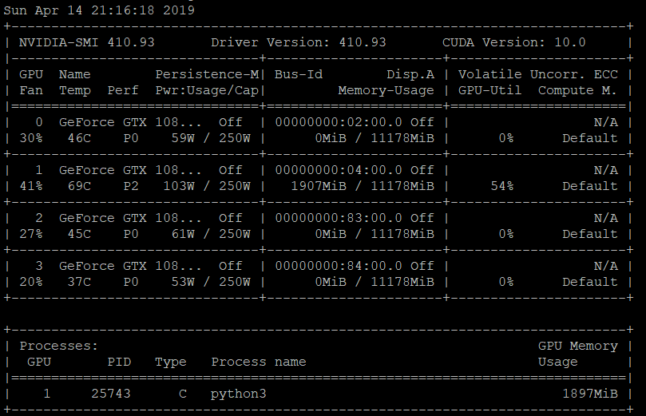

# 系统安装
* [硬盘分区](https://blog.csdn.net/u012052268/article/details/77145427)

# 驱动安装

* NVIDIA显卡驱动的安装
  1. 从官网下载驱动的.run文件
  2. 禁止集成的nouveau驱动
  ```
  # 查看属性
  sudo ls -lh /etc/modprobe.d/blacklist.conf

  # 修改属性
  sudo chmod 666 /etc/modprobe.d/blacklist.conf

  # 用编辑器打开, 这里展示用vim编辑器, 也可以用别的编辑器
  sudo vim /etc/modprobe.d/blacklist.conf

  # 在该文件后添加以下几行
  blacklist vga16fb
  blacklist nouveau
  blacklist rivafb
  blacklist rivatv
  blacklist nvidiafb

  # 保存后执行
  sudo update-initramfs -u

  # 重启后执行以下命令, 若没有输出, 则说明已经禁用nouveau驱动
  lsmod | grep nouveau
  ```
  3. 开始安装
  ```
  # 桌面版系统执行以下命令关闭图形界面
  sudo service lightdm stop

  # 卸载以前安装过的NVIDIA驱动
  sudo apt-get --purge remove nvidia-*

  # 安装指令, 以NVIDIA-Linux-x86_64-410.93.run为例
  sudo chmod a+x NVIDIA-Linux-x86_64-410.93.run
  sudo ./NVIDIA-Linux-x86_64-410.93.run -no-x-check -no-nouveau-check -no-opengl-files

  # 桌面版系统开启图形界面
  sudo service lightdm start
  ```
  在上述安装指令中，–no-opengl-files表示只安装驱动文件，不安装OpenGL文件，这个参数最重要。–no-x-check 安装驱动时不检查X服务。–no-nouveau-check 安装驱动时不检查nouveau（注：这个选项和禁止集成的nouveau驱动组成双保险，其实一项操作就可以了）。

  4. 查看显卡驱动版本、显卡使用情况等
  ```
  nvidia-smi
  ```
    

  显示以上内容即为安装成功  

  参考[链接](https://blog.csdn.net/qq_30163461/article/details/80314630)

# 安装cuda
到官网下载相应的.run文件并运行, 若已经安装过驱动, 则在安装过程中选择不安装NVIDIA驱动

# 安装cudnn
到官网下载相应的压缩文件
```
# 这里以cudnn-7.5-linux-x64-v5.1为例
# 解压缩
tar zxvf cudnn-7.5-linux-x64-v5.1.tgz

# 复制文件到相应目录
cd cuda
sudo cp include/cudnn.h /usr/local/include
sudo cp lib64/libcudnn.* /usr/local/lib

# 建立软连接
sudo ln -sf /usr/local/lib/libcudnn.so.5.1.3 /usr/local/lib/libcudnn.so.5
sudo ln -sf /usr/local/lib/libcudnn.so.5 /usr/local/lib/libcudnn.so
sudo ldconfig -v
```
